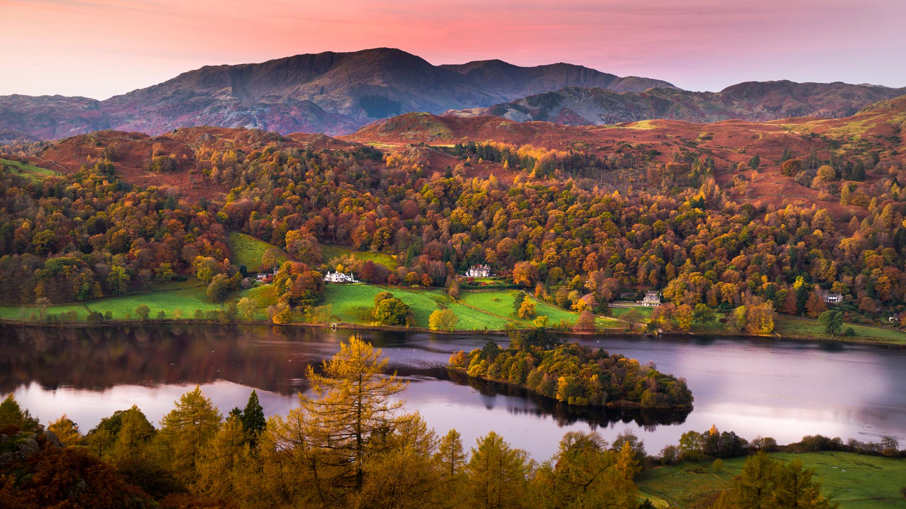
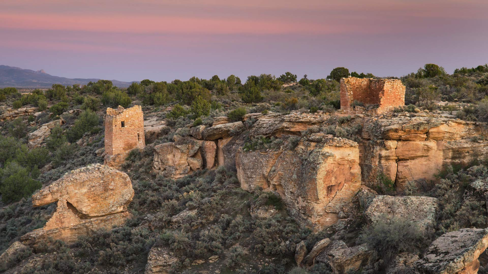

#### 20241104 Grasmere, Lake District, Cumbria, England (© Thomas Molyneux/Getty Images)

#### 20241103 Caribbean flamingo nests, Ría Lagartos Biosphere Reserve, Yucatán, Mexico (© Claudio Contreras/Minden Pictures)

#### 20241102 American bison in Yellowstone National Park, Wyoming (© Ian Shive/TANDEM Stills + Motion)

#### 20241101 秋季葡萄园的鸟瞰图，瓦恩哈尔特，黑森林，德国 (© Sabine Gerold/Amazing Aerial Agency)

#### 20241101 レンソイス・マラニャンセス国立公園, ブラジル マラニャン州 (© thanosquest/Shutterstock)

#### 20241101 Pueblo ruins, Hovenweep National Monument, Utah (© Alan Majchrowicz/Getty Images)

