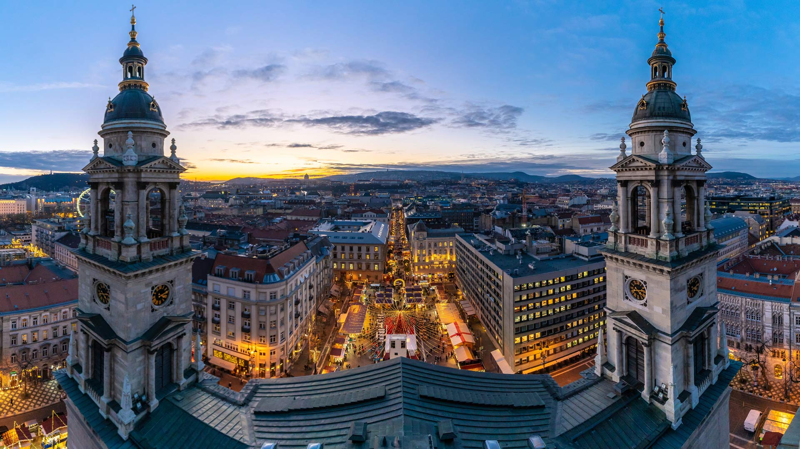
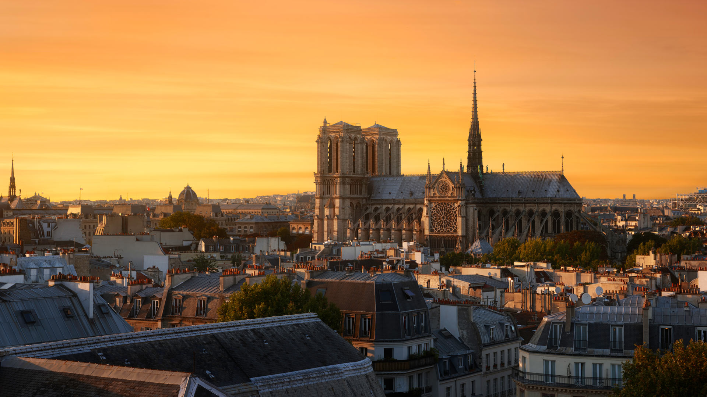
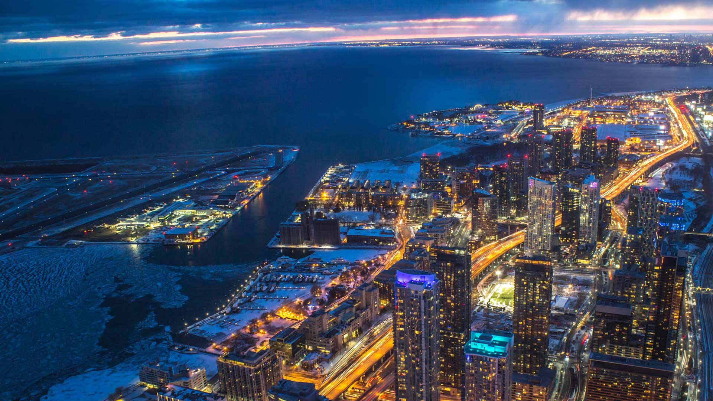
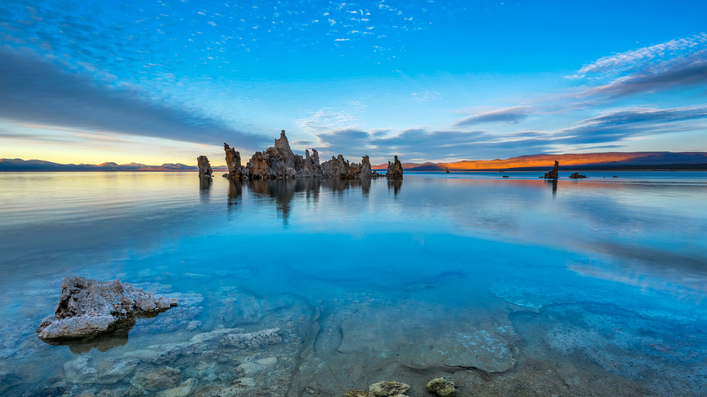

#### 20241214 猛鸮，加拿大 (© pchoui/Getty Images)

#### 20241213 Christmas market, St. Stephen's Basilica, Budapest, Hungary (© Calin Stan/Shutterstock)

#### 20241212 Wild poinsettia (aka Christmas flower) (© David Hosking/NPL/Minden Pictures)

#### 20241212 Gefrorener See bei Wintersonnenaufgang, Deutschland (© Marc_Osborne/Getty Images)

#### 20241211 Tre Cime di Lavaredo, Sexten Dolomites, Italy (© Daniel Maran/Getty Images)

#### 20241210 The Cornish Coast Path covered in snow, Land's End, Cornwall, England (© Josef FitzGerald-Patrick/Getty Images)

#### 20241209 Corals and the lagoon of Mo'orea in French Polynesia (© bru_greg/Getty Images)

#### 20241209 Guanacos, Torres del Paine National Park, Chile (© Floris van Breugel/NPL/Minden Pictures)

#### 20241208 Notre-Dame Cathedral, Paris, France (© Julien Fromentin/Getty Images)

#### 20241207 Lake Ontario in the winter season, Toronto (© Brendan Riley/Shutterstock)

#### 20241207 Pearl Harbor Memorial Bridge, New Haven, Connecticut (© Enzo Figueres/Getty Images)

#### 20241207 雪化粧の五稜郭, 北海道 函館 (© Hiro1775/Getty Images)

#### 20241207 里约热内卢州的阿拉亚尔多卡博，巴西 (© Derson Santana/Shutterstock)

#### 20241206 Old Town in Helsinki, Finland (© Oleksiy Mark/Shutterstock)

#### 20241206 鸟瞰冰封的大海和悬崖上的灯塔，大连泊霞湾公园，辽宁省，中国 (© zhengshun tang/Getty Images)

#### 20241206 Maisons traditionnelles alsaciennes à colombages et rivière Lauch Colmar, Alsace (© KavalenkavaVolha/Getty Images)

#### 20241205 Tufa formations in Mono Lake, California (© Susanna Patras/TANDEM Stills + Motion)

#### 20241204 Male white rhinoceroses, Lake Nakuru, Kenya (© Ingo Arndt/Minden Pictures)

#### 20241203 Sattais Katcheri (Court of 27 Pillars), Amber Fort, Rajasthan, India (© Yury Taranik/Shutterstock)

#### 20241203 花火と豪華な山車,埼玉県 秩父市 (© ASSOCIATED PRESS/AP)

#### 20241202 Female moose, Denali National Park, Alaska (© Cavan Images/Alamy)

#### 20241201 Icebergs, Antarctica (© Art Wolfe/DanitaDelimont.com)

#### 20241201 Verschneite Fachwerkhäuser in Freudenberg bei Siegen, Nordrhein-Westfalen (© Thorsten Frisch/Shutterstock)

