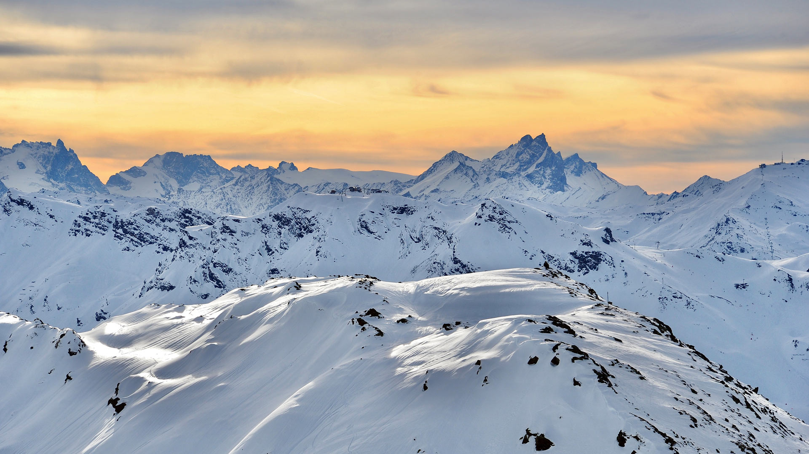

#### 20250104 归春河上的板约-德天瀑布，中国与越南边境 (© Shane P. White/Minden Pictures)

#### 20250104 丸い巨石が転がる海岸, ニュージーランド (© Douglas Pearson/eStock Photo)

#### 20250103 The Radcliffe Camera and All Souls College, University of Oxford, England (© atiger/Shutterstock)

#### 20250102 コセイインコ, インド カルナータカ州 (© Hira Punjabi/Alamy)

#### 20250102 Star trails over Ardez, Graubunden, Switzerland (© Roberto Moiola/Getty Images)

#### 20250102 Montagne enneigée au coucher du soleil, Alpes françaises (© raeva/Getty Images)

#### 20250101 朝日と白髭神社の鳥居, 滋賀県 高島市 (© Cavan Images/Alamy Stock Photo)

#### 20250101 Polar bears at play in the Arctic (© Ondrej Prosicky/Shutterstock)

