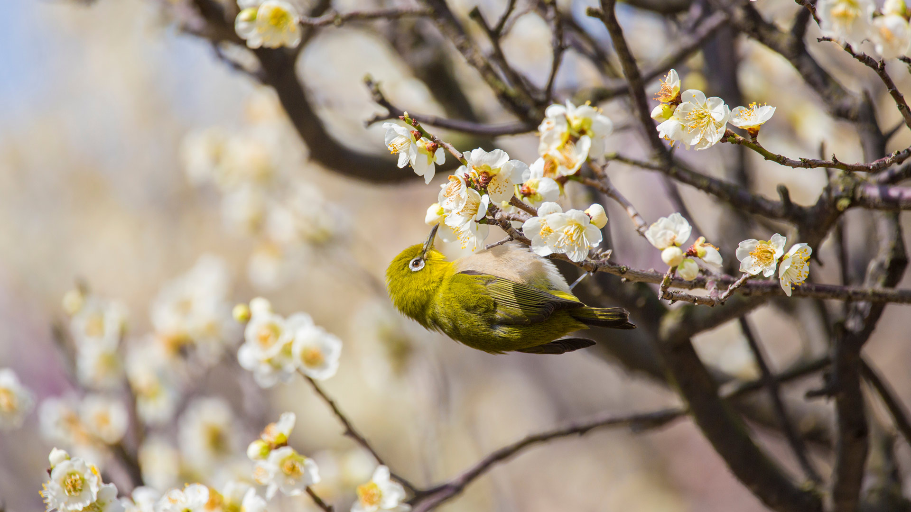

#### 20250203 梅の花で吸蜜するメジロ (© yankane/shutterstock)

#### 20250203 Ribblehead-Viadukt und Ingleborough-Berg, North Yorkshire, England, UK (© AWL Images/DanitaDelimont.com)

#### 20250203 盛开的樱花树上的红头长尾山雀 (© Haitong Yu/Getty Images)

#### 20250202 Westerhever, Nationalpark Schleswig-Holsteinisches Wattenmeer (© 3quarks/Getty Images)

#### 20250202 Young alpine marmot (© Jonas Fichtner-Pflaum/Getty Images)

#### 20250201 ゴールデンブリッジ, ベトナム (© Hien Phung Thu/Shutterstock)

#### 20250201 国王岩堡垒 , 瑞士撒克逊, 德国 (© Bildagentur-online/Exss/Alamy)

#### 20250201 Cerf élaphe, forêt de Rambouillet,  Île-de-France (© Nicolas Le Boulanger/500px/Getty Image)

#### 20250201 National Museum of African American History & Culture, Washington, DC (© BrianPIrwin/Shutterstock)

